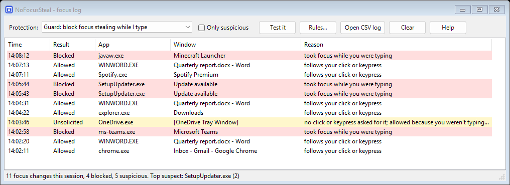

<p align="center"></p>

<h1 align="center">NoFocusSteal</h1>

<p align="center"><b>Stop apps from stealing focus on Windows, and find out which app keeps doing it.</b></p>

<p align="center">
  <a href="https://github.com/BoazCohenJ/NoFocusSteal/releases/latest/download/NoFocusSteal.exe"><b>⬇ Download NoFocusSteal.exe</b></a> ·
  <a href="https://boazcohenj.github.io/NoFocusSteal/">Website</a> ·
  <a href="#how-it-decides">How it works</a> ·
  <a href="#faq">FAQ</a>
</p>

You're typing an email and a Teams popup, an updater or a game launcher jumps in front. Half of your sentence lands in the wrong window, and sometimes the Enter or Space you just pressed clicks a button in a dialog you never saw.

NoFocusSteal is a tiny tray app that puts focus back where you were typing the moment another app grabs it. The offending app's taskbar button flashes instead, so you can switch to it when *you* want. It also logs every focus change, so the "something keeps stealing my focus and I don't know what" mystery can finally be solved.



## Features

- **Blocks focus stealing while you type.** Focus goes back to your window within a few dozen milliseconds, and the thief's taskbar button flashes.
- **Names the culprit.** Every focus change is logged with the app, window title, process ID and exe path. Invisible windows, the usual suspects behind "my window randomly loses focus", are flagged. Everything is also written to a CSV file, so you can leave it running overnight.
- **Leaves your own actions alone.** Clicking, Alt+Tab, Win-key shortcuts, closing a window, dialogs of the app you're using and the Start menu all work normally.
- **Four modes:** *Guard* (default: block only while you type), *Strict* (block anything you didn't ask for), *Log only* (just find the culprit) and *Off*.
- **Fixes the Windows 11 24H2 "games lose focus on every click" bug.** It always sends focus back when explorer.exe's invisible `MSCTFIME UI` window grabs it.
- **Works with focus-follows-mouse.** If you use X-Mouse (Windows' "activate a window by hovering over it", or [X-Mouse Controls](https://github.com/joelpurra/xmouse-controls)), pointing at a window still switches to it.
- **Per-app rules.** Right-click a row to always allow an app, or to block it even when you aren't typing.
- **Built-in test.** Click **Test it** to watch a window try to steal focus and fail.
- **Nothing injected.** No DLL injection and no API hooking of other programs, unlike older tools; see [how it works](#how-it-decides).
- **One ~100 KB exe.** No installer and nothing to install: it runs on the .NET Framework 4.8 that already ships with Windows 10 and 11. MIT licensed.

## Install

1. Download [`NoFocusSteal.exe`](https://github.com/BoazCohenJ/NoFocusSteal/releases/latest/download/NoFocusSteal.exe) from the [latest release](https://github.com/BoazCohenJ/NoFocusSteal/releases/latest).
2. Put it anywhere (for example `%LOCALAPPDATA%\NoFocusSteal\`) and run it.
3. Right-click the tray icon and tick **Start with Windows**.

The exe isn't code-signed yet, so SmartScreen may show "Windows protected your PC". Click **More info → Run anyway**, or build it yourself (below). Release builds are compiled by [GitHub Actions](.github/workflows/build.yml) from the tagged source and come with a SHA-256 checksum.

## How it decides

NoFocusSteal watches for foreground-window changes (`SetWinEventHook`) and watches your keyboard and mouse through Raw Input. From the input it keeps only *timestamps* and whether a key was "typing" or "a deliberate action"; which keys you press is never stored. It judges each focus change like this:

| Situation | Result |
|---|---|
| You clicked, pressed Alt/Win/Tab/Enter/Esc/F-keys or a Ctrl/Alt/Win shortcut, and haven't typed since | ✅ allowed: you asked for it |
| The previous window was closed, minimized or hidden | ✅ allowed: Windows has to put focus somewhere |
| Same app (a dialog, a new tab or window) | ✅ allowed |
| Start menu, search, Alt+Tab, lock screen, UAC | ✅ allowed |
| X-Mouse is on and you just pointed at the window | ✅ allowed |
| Another app grabs focus less than 1.5 s after you typed | ⛔ **blocked**: focus returns to your window and the app's taskbar button flashes |
| Another app grabs focus while you're idle | ⚠️ *Unsolicited*: allowed and highlighted in the log (blocked in **Strict** mode, except for apps you launched in the last 10 s) |

To take focus back it uses the same public Win32 calls any app can use (`AttachThreadInput` plus `SetForegroundWindow`). No code runs inside other processes. Input that software generates (the classic `keybd_event(VK_MENU)` focus-stealing trick) is ignored by default, so apps can't fake a keypress to get past it.

If an app keeps fighting back (12 grabs in 10 s), NoFocusSteal leaves it alone for a minute rather than loop forever.

## FAQ

**Which app is stealing my focus?** Run NoFocusSteal (the *Log only* mode works too) and wait for it to happen. Rows highlighted yellow or red are focus changes you didn't ask for. **Top suspect** in the status bar names the worst offender. Right-click → **Open file location** shows you exactly what it is.

**Does it work in games?** Yes. While you're pressing keys, a popup can't pull you out of a fullscreen game. For mouse-only games, use **Strict** mode.

**My game minimizes or loses focus every time I click (Windows 11 24H2, `explorer.exe` / `MSCTFIME UI`).** That's a Windows bug where an invisible input-method window takes focus. NoFocusSteal recognises that window and sends focus straight back to your game, in every mode except *Log only* and *Off*.

**Isn't X-Mouse / focus-follows-mouse the fix?** Tools like [X-Mouse Controls](https://github.com/joelpurra/xmouse-controls) make the window under your pointer active. That's great if you like that style, but it doesn't stop a popup from grabbing focus: your keystrokes still land in the popup until you move the mouse. X-Mouse is also a common *cause* of "my window randomly loses focus" when it's switched on by accident (Settings → Accessibility → Mouse → "Activate a window by hovering over it"). The two work together: with X-Mouse on, NoFocusSteal lets windows you point at take focus and blocks the rest.

**An app runs as administrator and still steals focus.** Windows doesn't let a normal app take focus back from an elevated one. Run NoFocusSteal as administrator too (the log tells you when this happens).

**I use Remote Desktop, Mouse Without Borders, Synergy or an on-screen keyboard.** Their input is software-generated, so add `trustInjectedInput=true` to `%APPDATA%\NoFocusSteal\settings.ini`.

**Where are the settings and log?** Settings: `%APPDATA%\NoFocusSteal\settings.ini` (plain text, commented). Log: `%LOCALAPPDATA%\NoFocusSteal\focus-log.csv` (rotates at 5 MB). Nothing is ever sent anywhere; the app has no network code at all.

**Why not just set `ForegroundLockTimeout` in the registry?** Windows stopped honouring that setting reliably years ago, and apps that steal focus deliberately bypass it anyway.

**Is it safe? It watches my keyboard.** It keeps the time of each keypress, not the key, and only in memory. The code is short; read [`InputTracker.cs`](src/NoFocusSteal/InputTracker.cs). No hooks, no injection, no network.

## Build from source

Requires the .NET SDK (8 or newer) on Windows.

```
dotnet test
dotnet build src/NoFocusSteal -c Release
```

The exe lands in `src/NoFocusSteal/bin/Release/net48/NoFocusSteal.exe`. The decision logic lives in [`FocusPolicy.cs`](src/NoFocusSteal/FocusPolicy.cs) and is unit-tested.

## Why this exists

People have been asking for this for over 15 years, and the answer kept being "no":

- Super User, [*Preventing applications from stealing focus*](https://superuser.com/questions/18383/preventing-applications-from-stealing-focus) (130k+ views). The accepted answer says it isn't possible *"without extensive manipulation of Windows internals"*.
- Super User, [*Active window unexpectedly loses focus*](https://superuser.com/questions/709052/active-window-program-unexpectedly-loses-focus-in-windows-7) (110k+ views, 22 answers of people guessing culprits).
- PowerToys, [*Disable focus stealing* (#65)](https://github.com/microsoft/PowerToys/issues/65), open since 2019 with 200+ reactions.
- Microsoft Q&A, [*How to prevent focus stealing*](https://learn.microsoft.com/en-us/answers/questions/2156085/how-to-prevent-focus-stealing) and [*Apps stealing focus*](https://learn.microsoft.com/en-us/answers/questions/3869634/apps-stealing-focus).

Earlier tools either only log (WindowFocusLogger, focusmonitor) or block by injecting a DLL into other apps ([StayFocused](https://github.com/bladeSk/StayFocused), whose last release was in 2020 and whose author moved to Linux in 2022 and stopped active development). NoFocusSteal does both jobs without injecting anything.

## License

[MIT](LICENSE)
